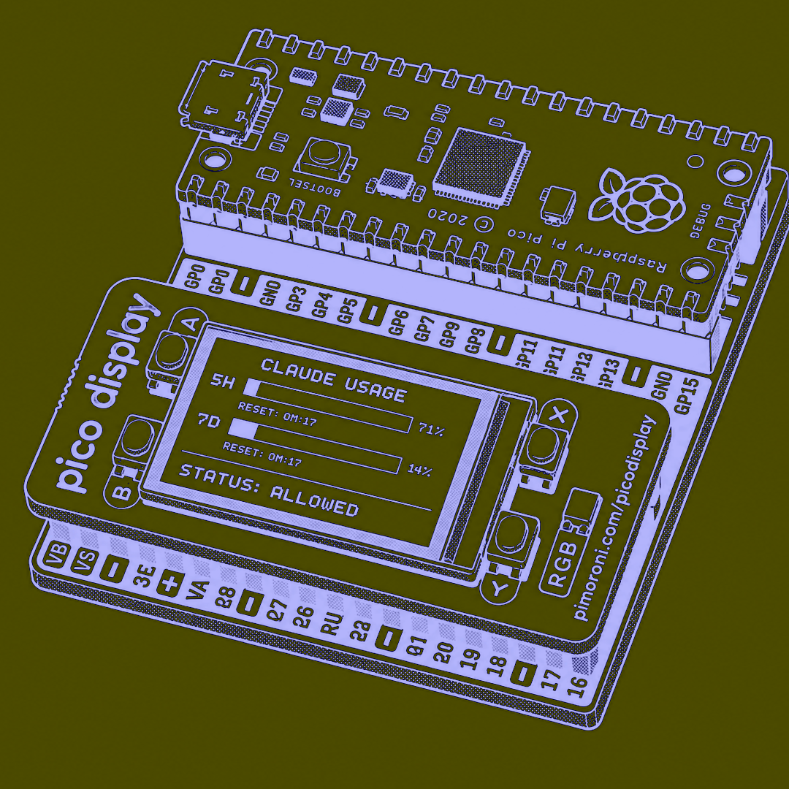

# Pico LLM Viewer

Raspberry Pi Pico firmware that displays Claude token usage in real time (5-hour session and 7-day weekly) on a Pimoroni Pico Display (ST7789).

A shell daemon runs on the host machine, polls the Anthropic API via rate-limit response headers, and sends a JSON payload to the Pico over USB serial.




## Requirements

**To build the firmware:**

| Tool | Minimum version |
|---|--|
| cmake | 3.12 |
| ninja | 1.13.2 |
| arm-none-eabi-g++ | 13+ |

```bash
# macOS
brew install cmake ninja
brew install --cask gcc-arm-embedded
```

**For linting only (`make lint`):**

| Tool | Purpose |
|---|---|
| llvm | provides `clang-format` and `clang-tidy` (Apple Clang does not include all checks) |
| shellcheck | static analysis for the shell daemon |

```bash
brew install llvm shellcheck
```

## Dependencies

Included as git submodules in `lib/` as they are not available in public registries:

| Submodule | Version |
|---|---|
| [pico-sdk](https://github.com/raspberrypi/pico-sdk) | 2.2.0 |
| [pimoroni-pico](https://github.com/pimoroni/pimoroni-pico) | v1.22.2 |

## Clone

```bash
git clone --recursive https://github.com/clement-software/pico-llm-viewer
cd pico-llm-viewer
```

If already cloned without `--recursive`:

```bash
git submodule update --init --recursive
```

## Build the firmware

```bash
make            # configure + compile to build/pico-llm-viewer.uf2
```

## Flash the Pico

1. Hold **BOOTSEL** whilst plugging the Pico in via USB
2. Copy `build/pico-llm-viewer.uf2` to the `RPI-RP2` drive

## Run the host daemon

```bash
./claude-usage-daemon.sh                          # auto-detect port
./claude-usage-daemon.sh -p /dev/cu.usbmodem1234  # explicit port
./claude-usage-daemon.sh -i 60                    # 60s interval (default: 300s)
./claude-usage-daemon.sh --help
```

The daemon reads the Claude token from the macOS Keychain (`Claude Code-credentials`) or `~/.claude/.credentials.json`.

## Tests

```bash
make test
```

Unit tests (GTest) cover `DisplayUsageUseCase` and `ClaudeUsageJsonParser`, the two components that are independent of the Pico SDK.

## Development

```bash
make fmt          # reformat all files in src/ and main.cpp
make lint         # clang-format + clang-tidy + shellcheck
make clean        # remove build directories
```

## Architecture

The project follows a Hexagonal Architecture (Ports & Adapters).

The **domain** (`src/domain/`) defines the `LlmUsage` data type.

The **application layer** (`src/display_usage/`) defines two abstract ports and a use case. `DisplayOutPort` (outbound port) describes how to render data. `UsageInPort` (inbound port) describes how to receive an update. `DisplayUsageUseCase` orchestrates the two.

The **adapters** (`src/adapters/`) provide the concrete implementations: `ClaudeUsageJsonParser` converts incoming JSON into `LlmUsage`, `SerialLineReader` reads the USB serial line and calls the inbound port, `PicoGraphicsDisplay` implements the outbound port and drives the ST7789 display.

## Licence

This project is licensed under the GNU Affero General Public License v3.0.
See `LICENSE` for details.
